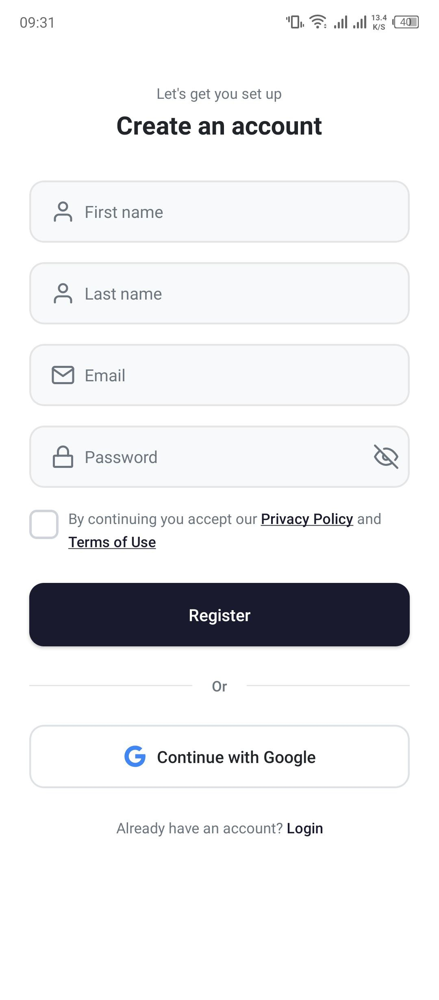
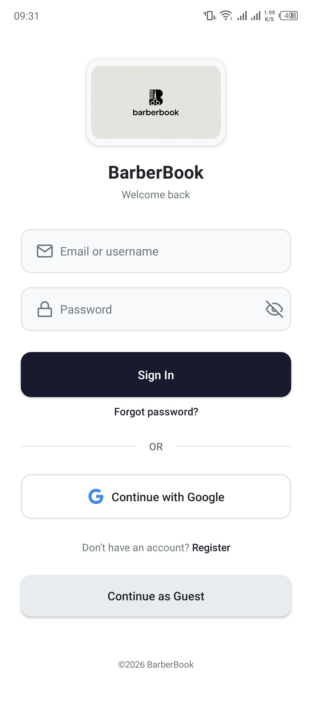
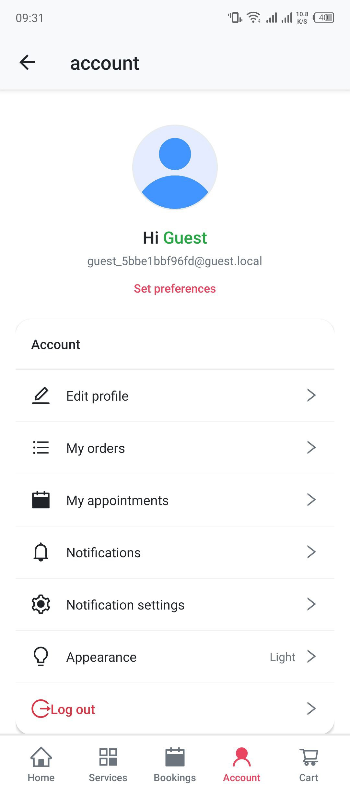
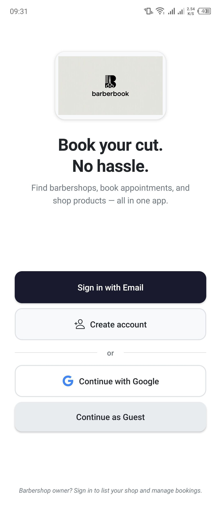
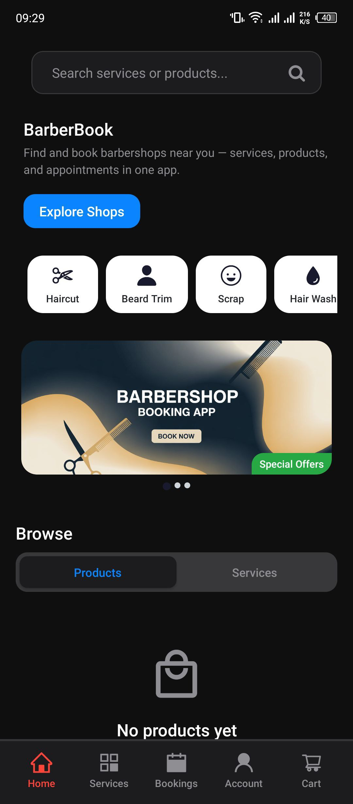
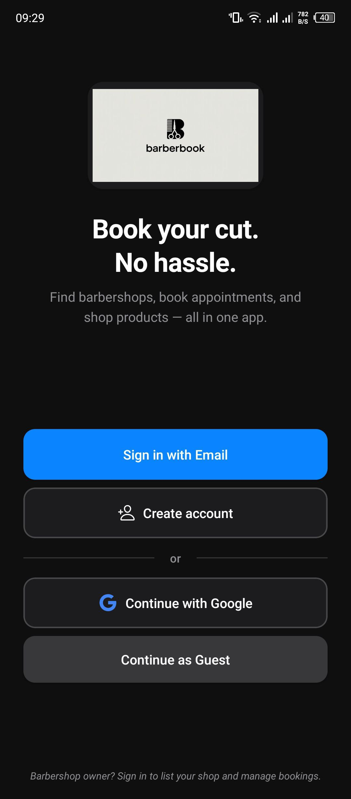

# BarberBook

Barbershop booking and management system. Mobile-first Expo client and Django REST API for customers and shop owners.

## Architecture Overview

- **Frontend:** React Native (Expo)
- **Backend:** Django + Django REST Framework
- **Authentication:** JWT + Google OAuth
- **Database:** PostgreSQL (PostGIS for geo)
- **State Management:** React Context (Auth, Cart, Barbershop, Theme)
- **Deployment:** Backend on Render (Docker); client via EAS Build

## System Capabilities

- User authentication (Email + Google OAuth)
- Appointment booking
- Barber scheduling
- Role-based access control (Customer, Barber, Admin)
- Secure API communication (JWT, HTTPS)

## Screenshots

### Screenshot 1


### Screenshot 2


### Screenshot 3


### Screenshot 4


### Screenshot 5


### Screenshot 6


### Screenshot 7


### Screenshot 8


## Environment Variables

### Backend (root `.env`)

| Variable | Required | Description |
|----------|----------|-------------|
| `DB_HOST`, `DB_PORT`, `DB_NAME`, `DB_USER`, `DB_PASSWORD` | Yes | PostgreSQL connection |
| `SECRET_KEY` | Yes | Django secret key |
| `DEBUG` | No | Set to `False` in production |
| `ALLOWED_HOSTS` | Yes (prod) | Comma-separated hostnames |
| `CORS_ALLOWED_ORIGINS` | No | Allowed front-end origins |
| `GOOGLE_CLIENT_ID` | For Google OAuth | Web client ID for token verification |
| `ADMIN_EMAIL`, `ADMIN_PASSWORD` | Optional | One-time admin bootstrap |
| `EMAIL_*`, `EMAIL_VERIFICATION_BASE_URL` | Optional | SMTP and verification links |
| `CLOUDINARY_*`, `CHAPA_*` | Optional | Media and payments |

### Frontend (`client/.env`)

| Variable | Required | Description |
|----------|----------|-------------|
| `EXPO_PUBLIC_API_URL` | No | API base URL (no trailing slash). Omit for production default |
| `EXPO_PUBLIC_GOOGLE_WEB_CLIENT_ID` | For Google OAuth | Google OAuth web client ID |
| `EXPO_PUBLIC_ANDROID_CLIENT_ID` | For Google OAuth (Android) | Android OAuth client ID |
| `EXPO_PUBLIC_GOOGLE_REDIRECT_URI` | No | Override redirect URI (default: Expo auth proxy) |
| `EXPO_PUBLIC_GOOGLE_MAPS_API_KEY` | For map | Google Maps SDK key (Android) |
| `EXPO_PUBLIC_PRIVACY_URL`, `EXPO_PUBLIC_TERMS_URL` | No | Privacy and terms URLs |
| `EXPO_PUBLIC_FORCE_WELCOME` | No | Set to `true` to always show Welcome screen |

Do not commit `.env` or any file containing secrets.

## Running Locally

### Backend

```bash
# From repo root
cp .env.example .env
# Set SECRET_KEY, DB_NAME, DB_USER, DB_PASSWORD (DB_HOST=db for Docker)
docker compose up --build
```

API: http://localhost:8000  
Admin: http://localhost:8000/admin/  
Docs: http://localhost:8000/api/docs/

Create superuser: `docker compose exec backend python manage.py createsuperuser`

### Frontend

```bash
cd client
cp .env.example .env
# Set EXPO_PUBLIC_API_URL=http://<YOUR_IP>:8000/api for physical device
npm install
npx expo start
```

## Google OAuth Configuration

**Authorized redirect URI:**

```
https://auth.expo.io/@mullervic/barberbook
```

Configure this URI in [Google Cloud Console](https://console.cloud.google.com/) under **APIs & Services → Credentials → Web Application** client. Add it to **Authorized redirect URIs**. The same Web client ID is used for Expo proxy auth and must be set as `GOOGLE_CLIENT_ID` (backend) and `EXPO_PUBLIC_GOOGLE_WEB_CLIENT_ID` (client).

## Security Considerations

- JWT authentication (access + refresh; token blacklist supported)
- OAuth 2.0 (Google ID token verified on backend)
- Environment-based configuration; no secrets in repo
- Role-based access control enforced in API views
- CORS restricted via `CORS_ALLOWED_ORIGINS`
- Set `DEBUG=False` in production

---

License: Proprietary.
